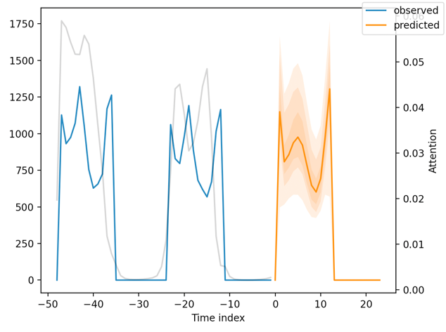

# Forecasting with the Temporal Fusion Transformer

Multi-horizon forecasting often contains a complex mix of inputs – including
static (i.e. time-invariant) covariates, known future inputs, and other exogenous
time series that are only observed in the past – without any prior information
on how they interact with the target. Several deep learning methods have been
proposed, but they are typically ‘black-box’ models which do not shed light on
how they use the full range of inputs present in practical scenarios. In this paper, we introduce the Temporal Fusion Transformer (TFT) – a novel attentionbased architecture which combines high-performance multi-horizon forecasting
with interpretable insights into temporal dynamics. To learn temporal relationships at different scales, TFT uses recurrent layers for local processing and
interpretable self-attention layers for long-term dependencies. TFT utilizes specialized components to select relevant features and a series of gating layers to
suppress unnecessary components, enabling high performance in a wide range of
scenarios. On a variety of real-world datasets, we demonstrate significant performance improvements over existing

* [PyTorch Tutorial - Temporal Fusion Transformers](https://pytorch-forecasting.readthedocs.io/en/latest/tutorials/stallion.html)
* [PyTorch Tutorial - TimeSeriesDataSet](https://pytorch-forecasting.readthedocs.io/en/latest/api/pytorch_forecasting.data.timeseries.TimeSeriesDataSet.html#timeseriesdataset)
* [Paper - Temporal Fusion Transformers
for Interpretable Multi-horizon Time Series Forecasting](https://arxiv.org/pdf/1912.09363.pdf)